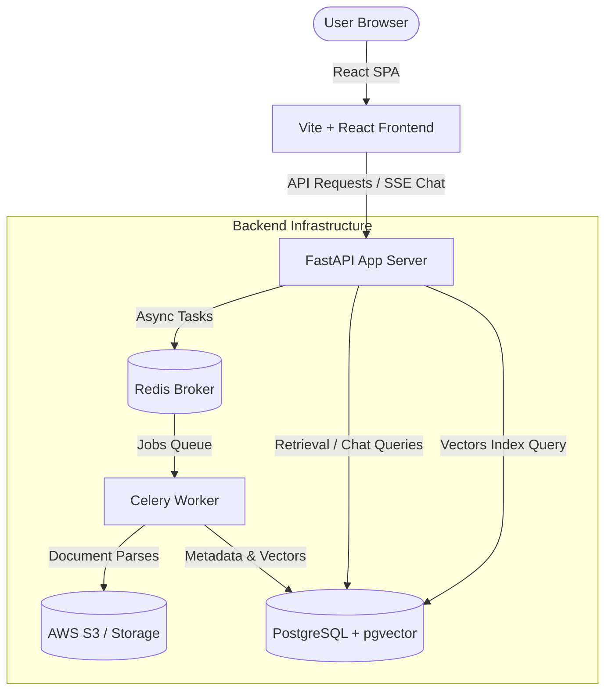

# VectraFlow

VectraFlow is an AI-native, production-grade Retrieval-Augmented Generation (RAG) knowledge assistant. It allows developers and teams to ingest files (PDF, DOCX, TXT, MD), recursively chunk and index them into vector databases, and perform low-latency semantic queries with citation engine traces, SSE chat streaming, and direct retrieval debugging.

---

## System Architecture

The project is split into a **FastAPI backend** (celery task-based parsing + PostgreSQL vector database) and a **Vite + React SPA frontend** (styled with Vanilla CSS for maximum visual fidelity and caching with React Query).



---

## Repository Structure

```
VectraFlow/
├── vectraflow-backend/        # FastAPI Application Engine
│   ├── app/
│   │   ├── api/               # Endpoint controllers (auth, KBs, documents, chat)
│   │   ├── core/              # Config, database setup, JWT security
│   │   ├── models/            # SQLAlchemy database schemas
│   │   ├── schemas/           # Pydantic schemas
│   │   ├── services/          # Storage, vector indexes, document parsers
│   │   ├── tasks/             # Celery background worker tasks
│   │   └── main.py            # FastAPI entry point
│   ├── docker-compose.yml     # Containerized PostgreSQL, Redis, Worker, API
│   ├── requirements.txt       # Python Dependencies
│   └── alembic/               # Database Migrations
│
└── vectraflow-frontend/       # React SPA Frontend Client
    ├── src/
    │   ├── api/               # Axios clients, API hooks, typescript definitions
    │   ├── components/        # Layout wrappers (Sidebar, TopNav, AppShell)
    │   ├── hooks/             # Fetch Streams API hook (useSSEChat)
    │   ├── pages/             # Auth, Dashboard, KB Detail, Chat, Retrieval, Settings
    │   ├── stores/            # Zustand global state (authStore, chatStore)
    │   └── styles/            # CSS tokens, globals, and custom animations
    ├── vite.config.ts         # Vite Configuration
    └── package.json           # Frontend Dependencies
```

---

## Tech Stack

### Backend
* **Web Framework**: FastAPI (Uvicorn server)
* **Database**: PostgreSQL with `pgvector` extension (SQLAlchemy 2.0 Async)
* **Broker & Cache**: Redis
* **Background Processing**: Celery (handles long document ingestion, table extractions)
* **LLM Integrations**: Groq Cloud (Llama 3.3 70B), HuggingFace TEI (Text Embeddings)

### Frontend
* **Core**: React 18, Vite 5, TypeScript 5
* **Routing**: React Router v6 (lazy-loaded pages)
* **Server State**: TanStack Query v5 (React Query)
* **Global State**: Zustand
* **SSE Stream Parser**: Fetch Streams API (supports Authorization Headers)
* **Design & Styling**: Custom HSL dark theme tokens & vanilla CSS

---

## Getting Started

### Backend Setup

#### 1. Configure Environment Variables
Copy `.env.example` to `.env` inside `vectraflow-backend/` and fill in the missing keys (e.g. AWS credentials, DB credentials, Groq API Key):
```bash
cd vectraflow-backend
cp .env.example .env
```

#### 2. Start Services via Docker Compose
To boot up the Postgres DB (with pgvector), Redis, Celery Worker, and FastAPI server in parallel:
```bash
docker compose up -d --build
```
This automatically applies Alembic migrations and binds the API to `http://localhost:8000`.

---

### Frontend Setup

#### 1. Install Node Dependencies
Navigate to `vectraflow-frontend/` and install npm packages:
```bash
cd vectraflow-frontend
npm install
```

#### 2. Start Vite Development Server
Run Vite:
```bash
npm run dev
```
The app will start running locally at `http://localhost:5173/`.

#### 3. Build for Production
To package minified assets into `dist/`:
```bash
npm run build
```

---

## Screen Features

* **Dashboard**: Focus Metrics, Total KB metrics, Documents breakdown stats, and recent chat history summaries.
* **Authentication**: Isolated clean Login and Register screens.
* **Chat Workspace**: SSE Fetch-based streaming response tokens with active stage indicators, expandable citation details drawer, message thumbs feedback ratings, and golden evaluation dataset promotion chips.
* **Knowledge Base Detail**: File drop-zones with dynamic ingestion status polling, raw chunks inspector, and custom SVG status charts.
* **Retrieval Playground**: Score parameter threshold sliders (Dense query targeting) to audit raw chunks retrieved from vector partition scopes.
* **Settings**: Change display profile names and trigger secure password reset requests.
