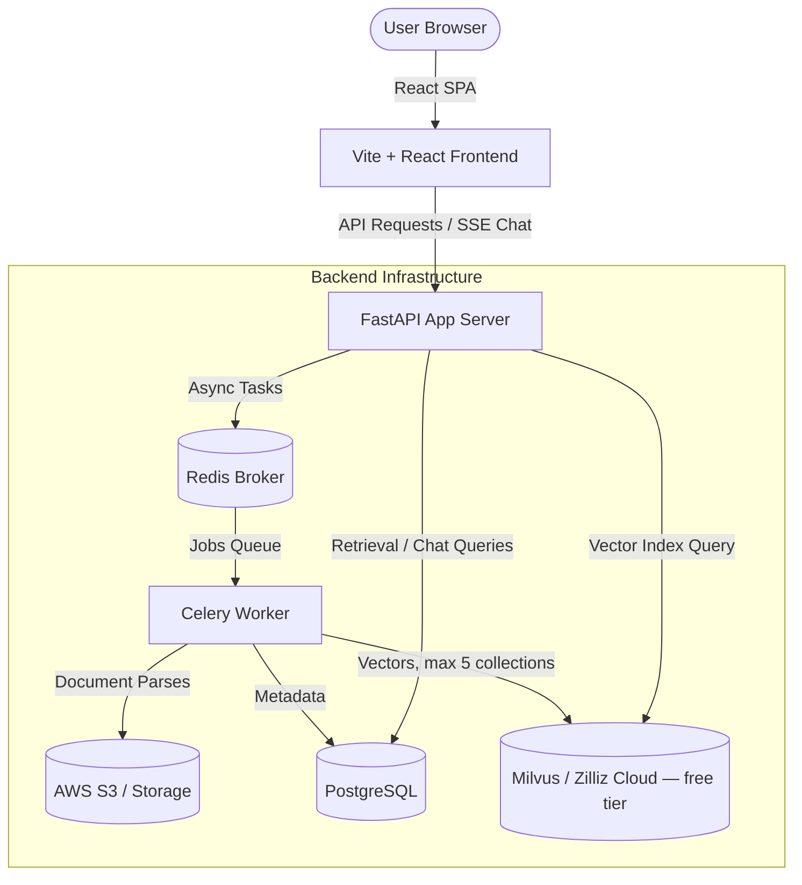

# VectraFlow

VectraFlow is an AI-native, production-grade Retrieval-Augmented Generation (RAG) knowledge assistant. It allows developers and teams to ingest files (PDF, DOCX, TXT, MD), recursively chunk and index them into vector databases, and perform low-latency semantic queries with citation engine traces, SSE chat streaming, and direct retrieval debugging.

---

## Live demo notes

This hosted instance runs entirely on free-tier infrastructure, so a couple of things are worth knowing before you dive in:

* **Only 5 knowledge bases can exist at a time.** Vector collections are stored on [Zilliz Cloud](https://zilliz.com/)'s free tier, which caps an account at 5 collections total — shared across every visitor to this demo, not just you. If knowledge base creation fails with a "limit reached" message, delete an existing one (any knowledge base, from any user, can be deleted from the app for exactly this reason) to free up a slot, then create yours.
* **Total document storage is capped at 5GB app-wide.** Uploaded files live in AWS S3, whose free tier only covers 5GB (for the first 12 months) — beyond that, storage is billed. Uploads that would push the app over that cap are rejected; delete some documents or a knowledge base to free up room.
* **Embeddings run on Cohere's hosted API**, not a self-hosted GPU box. An earlier version of this project ran Hugging Face TEI on a self-managed EC2 instance for embeddings; that's been retired in favor of Cohere's Embed API so the app has no backing server to keep alive (and no EC2 bill).

---

## System Architecture

The project is split into a **FastAPI backend** (Celery task-based parsing + Milvus/Zilliz Cloud vector store + PostgreSQL metadata) and a **Vite + React SPA frontend** (styled with Vanilla CSS for maximum visual fidelity and caching with React Query).


```mermaid
graph TD
    User([User Browser]) -->|React SPA| FE[Vite + React Frontend]
    FE -->|API Requests / SSE Chat| BE[FastAPI App Server]
    
    subgraph Backend Infrastructure
        BE -->|Async Tasks| Redis[(Redis Broker)]
        Redis -->|Jobs Queue| CW[Celery Worker]
        CW -->|Document Parses| S3[(AWS S3 / Storage)]
        CW -->|Metadata| DB[(PostgreSQL)]
        CW -->|Vectors, max 5 collections| MV[(Milvus / Zilliz Cloud — free tier)]
        
        BE -->|Retrieval / Chat Queries| DB
        BE -->|Vector Index Query| MV
    end
```

---

## Repository Structure

```
VectraFlow/
├── vectraflow-backend/        # FastAPI Application Engine
│   ├── app/
│   │   ├── api/               # Endpoint controllers (auth, KBs, documents, chat)
│   │   ├── core/              # Config, database setup, JWT security
│   │   ├── models/            # SQLAlchemy database schemas
│   │   ├── schemas/           # Pydantic schemas
│   │   ├── services/          # Storage, vector indexes, document parsers
│   │   ├── tasks/             # Celery background worker tasks
│   │   └── main.py            # FastAPI entry point
│   ├── docker-compose.yml     # Containerized PostgreSQL, Redis, Worker, API
│   ├── requirements.txt       # Python Dependencies
│   └── alembic/               # Database Migrations
│
└── vectraflow-frontend/       # React SPA Frontend Client
    ├── src/
    │   ├── api/               # Axios clients, API hooks, typescript definitions
    │   ├── components/        # Layout wrappers (Sidebar, TopNav, AppShell)
    │   ├── hooks/             # Fetch Streams API hook (useSSEChat)
    │   ├── pages/             # Auth, Dashboard, KB Detail, Chat, Retrieval, Settings
    │   ├── stores/            # Zustand global state (authStore, chatStore)
    │   └── styles/            # CSS tokens, globals, and custom animations
    ├── vite.config.ts         # Vite Configuration
    └── package.json           # Frontend Dependencies
```

---

## Tech Stack

### Backend
* **Web Framework**: FastAPI (Uvicorn server)
* **Database**: PostgreSQL for relational metadata (SQLAlchemy 2.0 Async)
* **Vector Store**: Milvus / Zilliz Cloud (free tier — capped at 5 collections, enforced app-wide)
* **Broker & Cache**: Redis
* **Background Processing**: Celery (handles long document ingestion, table extractions)
* **LLM Integrations**: Groq Cloud (Llama 3.3 70B) for generation, Cohere Embed API (hosted, no self-hosted server) for embeddings, Cohere Rerank for reranking

### Frontend
* **Core**: React 18, Vite 5, TypeScript 5
* **Routing**: React Router v6 (lazy-loaded pages)
* **Server State**: TanStack Query v5 (React Query)
* **Global State**: Zustand
* **SSE Stream Parser**: Fetch Streams API (supports Authorization Headers)
* **Design & Styling**: Custom HSL dark theme tokens & vanilla CSS

---

## Getting Started

### Backend Setup

#### 1. Configure Environment Variables
Copy `.env.example` to `.env` inside `vectraflow-backend/` and fill in the missing keys (e.g. AWS credentials, DB credentials, Groq API Key):
```bash
cd vectraflow-backend
cp .env.example .env
```

#### 2. Start Services via Docker Compose
To boot up the Postgres DB (with pgvector), Redis, Celery Worker, and FastAPI server in parallel:
```bash
docker compose up -d --build
```
This automatically applies Alembic migrations and binds the API to `http://localhost:8000`.

---

### Frontend Setup

#### 1. Install Node Dependencies
Navigate to `vectraflow-frontend/` and install npm packages:
```bash
cd vectraflow-frontend
npm install
```

#### 2. Start Vite Development Server
Run Vite:
```bash
npm run dev
```
The app will start running locally at `http://localhost:5173/`.

#### 3. Build for Production
To package minified assets into `dist/`:
```bash
npm run build
```

---

## Screen Features

* **Dashboard**: Focus Metrics, Total KB metrics, Documents breakdown stats, and recent chat history summaries.
* **Authentication**: Isolated clean Login and Register screens.
* **Chat Workspace**: SSE Fetch-based streaming response tokens with active stage indicators, expandable citation details drawer, message thumbs feedback ratings, and golden evaluation dataset promotion chips.
* **Knowledge Base Detail**: File drop-zones with dynamic ingestion status polling, raw chunks inspector, and custom SVG status charts.
* **Retrieval Playground**: Score parameter threshold sliders (Dense query targeting) to audit raw chunks retrieved from vector partition scopes.
* **Settings**: Change display profile names and trigger secure password reset requests.
